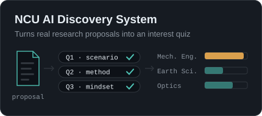
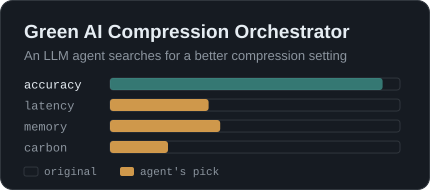

<b>English</b> · <a href="https://github.com/clairechien0627/clairechien0627/blob/main/README.zh-TW.md">繁體中文</a>

<picture>
  <source media="(prefers-color-scheme: dark)" srcset="./assets/hero-dark.svg">
  <source media="(prefers-color-scheme: light)" srcset="./assets/hero-light.svg">
  
</picture>

### Featured

<a href="https://github.com/clairechien0627/NCU_AI_Guidance"><picture><source media="(prefers-color-scheme: dark)" srcset="./assets/card-ncu-dark.svg"><source media="(prefers-color-scheme: light)" srcset="./assets/card-ncu-light.svg"></picture></a>
<a href="https://github.com/clairechien0627/Green_AI_Compression_Orchestrator"><picture><source media="(prefers-color-scheme: dark)" srcset="./assets/card-green-dark.svg"><source media="(prefers-color-scheme: light)" srcset="./assets/card-green-light.svg"></picture></a>

### More Projects

 **AI Applications**

- [AI Bartender](https://github.com/clairechien0627/Cocktail_AI): LangGraph agent for cocktail discovery and recommendations
- [SnackLens](https://github.com/clairechien0627/SnackLens): vision assistant for reading snack nutrition labels
- [Recipe Chatbot](https://github.com/clairechien0627/GenAI_recipe_chatbot): RAG recipe search with explainable scoring

 **Systems & Networking**

- [gem5 + NVMain](https://github.com/clairechien0627/NVmain_Gem5): cache replacement policies for non-volatile memory
- [Socket Programming](https://github.com/clairechien0627/Socket_Programming): encrypted chat over TCP/UDP with P2P sharing
- [Escape Docker](https://github.com/clairechien0627/EscapeDocker): escape-room game for learning Linux and Docker
- [Assembly Games](https://github.com/clairechien0627/AssemblyFinal): Win32 mini-games written in x86 assembly

 **Apps & Visualization**

- [Cake Game](https://github.com/clairechien0627/CakeGame): Android puzzle game about merging cake slices
- [Wealth Visualization](https://github.com/clairechien0627/data_visualization_on_rich): interactive web app on global billionaire wealth
- [DataViz Homework](https://github.com/clairechien0627/DataViz-Midterm): Plotly.js charts of Taiwan education and health data

<b>Course timeline</b>

| Semester | Course | Project |
|---|---|---|
| Spring 2026 | Introducing Generative AI for Humanities | [SnackLens](https://github.com/clairechien0627/SnackLens) |
| Spring 2026 | Linux and Edge Computing | [Escape Docker](https://github.com/clairechien0627/EscapeDocker) |
| Fall 2025 | Computer Network | [AI Bartender](https://github.com/clairechien0627/Cocktail_AI), [Socket Programming](https://github.com/clairechien0627/Socket_Programming) |
| Fall 2025 | Introduction to Machine Learning | [Coursework](https://github.com/clairechien0627?tab=repositories&q=1141-ML) |
| Spring 2025 | Computer Organization | [gem5 + NVMain](https://github.com/clairechien0627/NVmain_Gem5) |
| Spring 2025 | Python Programming & Generative AI | [Recipe Chatbot](https://github.com/clairechien0627/GenAI_recipe_chatbot) |
| Fall 2024 | Assembly Language and System Programming | [Assembly Games](https://github.com/clairechien0627/AssemblyFinal) |
| Spring 2024 | Introduction to Computer Science II Lab | [Cake Game](https://github.com/clairechien0627/CakeGame) |
| Fall 2023 | Data Visualization | [Wealth Visualization](https://github.com/clairechien0627/data_visualization_on_rich), [DataViz Homework](https://github.com/clairechien0627/DataViz-Midterm) |

### Skills

**Languages** · Python · C/C++ · Java · TypeScript 
**LLM & AI** · PyTorch · Transformers · LangGraph · RAG · GPTQ / AWQ 
**Systems & Web** · React · FastAPI · Docker · Linux · gem5
